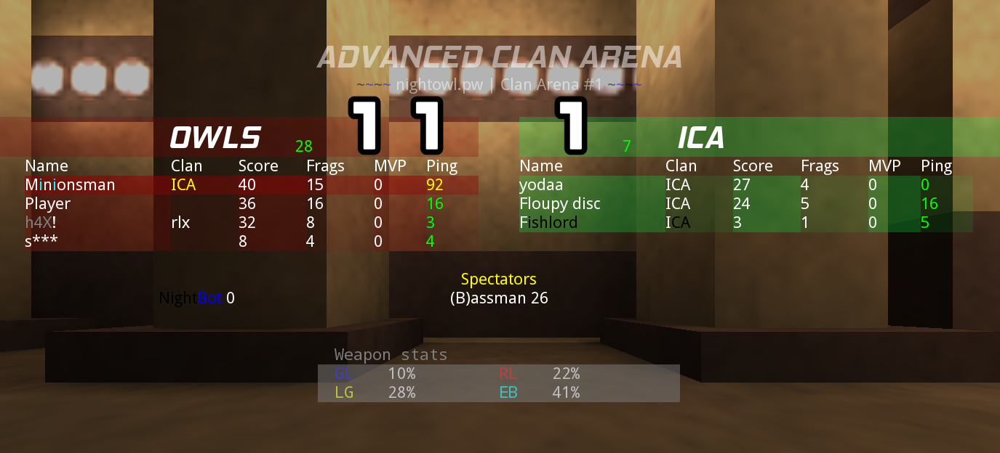

# This directory contains the demo scraper portion of this project.

## About
My most recent demos are not automatically parsed and loaded into the database.
This part is done semi-manually using this script, main.py
First, you must extract your .wdz20 files into this demos directory (this part is not automated yet.)
It reads through all directories found in the [demos](./demos) directory and stores relevant statistics in the database.
This script initially wipes the database, and then populates it with data from the demos. This means that all demo scraping is done at the same time.
Whenever you want to load new demos into the project, just put them in the [demos](./demos) directory, and run main.py.
For each demo, the script attempts to parse accuracy information for each player.
However, I am disregarding other players' information. I'm only interested in my statistics, and that's what gets loaded into the database.

## The .wdz20 filetype

The file [main.py](./main.py) contains some notes of me working through the .wdz20 filetype, but I will explain them more here.

As mentioned before, a Warsow demo is essentially a list of commands that represent the state of the game at each point in time. For example, the names of each player, the positions of their player model at each point in time, chat messages, the scoreboard, etc. When you use the Warsow client to view a demo file, it reconstructs the game and displays it to you.

Sidenote: This is pretty cool. It doesn't matter what your config was at the time of the demo. You can change your config to whatever you want, and watch any demo from any point in time.

By using the `strings` utility on the extracted .wdz20 file, we can view printable character sequences from it, which are the commands I was talking about earlier.

For example, this is a line we might see in the file:

`ch 10 "(v) Good game!"`

This represents a chat message from player 10, which reads "(v) Good game!".

You might also see a line like this:

`tch 2 "B"`

This represents a TEAM chat message from player 2, which reads "B".

You'll also see more complicated lines, for example, this:

`scb "&t 2 11 28 &p 12 ^3ICA^7 40 15 0 92 0 &p 4 ^7 36 16 0 16 0 &p 1 rlx^7 32 8 0 3 0 &p 3 ^7 8 4 0 4 0 &t 3 1 7 &p 7 ICA^7 27 4 0 0 0 &p 8 ICA^7 24 5 0 16 0 &p 2 ^7I^0CA^7 3 1 0 5 0 &s 6 26 0 0 &y "`

This represents the scoreboard at some particular time in the game. I know exactly when, and this is what the scoreboard would look like in-game: 



By comparing the two, we can easily reverse-engineer the otherwise confusing `scb` line of text. It simply contains the text for each row on the scoreboard, starting from the top left and going down. 

`&t 2 11 28` means this is some team (numbered 2), with a score of 11 and a ping of 28. If we look at the image, we can see that indeed, team OWLS has a score of 11 and an average ping of 28.

The section `&p 12 ^3ICA^7 40 15 0 92 0` represents some player (numbered 12), with a clan tag of ICA, a score of 40, 15 frags, 0 MVPs, and 92 ping. There is always an extra 0 at the end; I'm not sure what this represents. If we cross reference this with the image, we can see that indeed, the top-left row of the scoreboard has a player with this information.

But just who is this player 12? They are represented as `&p 12` in the file, but in the image, we can see they have a name. There does this come from?

In the first few hundred lines of the output of `strings`, we will see a bunch of lines like this:

```
cs 2912 "\name\^0Night^4Bot\hand\2\color\255 255 255"

cs 2913 "\name\^9h4X^7!\hand\2\color\222 222 222"

cs 2914 "\name\Sub\hand\0\color\255 255 255"

cs 2915 "\name\Player^7(3)\hand\0\color\222 222 222"

cs 2916 "\name\Player\hand\2\color\0 125 150"

cs 2917 "\name\Sans\hand\0\color\0 255 255"

cs 2918 "\name\(B)assman\hand\0\color\255 0 255"

cs 2919 "\name\yodaa\hand\0\color\0 255 255"

cs 2920 "\name\Floupy disc\hand\2\color\128 255 128"

cs 2922 "\name\Player^7(4)\hand\0\color\234 241 57"

cs 2923 "\name\Player^7(1)\hand\0\color\102 99 180"

cs 2924 "\name\M^5i^7n^5i^7onsman\hand\0\color\255 128 128"
```

A line like this appears whenever a player connects to the server for the first time in a match. When the server switches maps, all players reconnect to the server automatically, which is why we see all of these consecutive lines.

The first line contains `cs 2912`. This is the number that we will be referring to this player by for the rest of the demo, except...there's some offset, which is 2912. We can see that each consecutive player gets a new number. If we subtract 2912 from them, we can get their player number for this particular demo. 

Remember that section from the `scb` line we were talking about before? 

`&p 12 ^3ICA^7 40 15 0 92 0`? 

Well, it refers to player 12. Cross-referencing the image of the scoreboard, we can see that this player's name is *Minionsman* . Sure enough, if we look at the line

`cs 2924 "\name\M^5i^7n^5i^7onsman\hand\0\color\255 128 128"`

we can see that the player *Minionsman* was assigned the number 2924-2912 = **12**. Cool, huh? Remember that.

Sidenote: In Warsow/Warfork, colors can be used in names with the combination of the character ^ and a number. I know that ^5 means cyan, and ^7 means white. If we look at the image of the scoreboard, we can see that this player colored two characters in their name to be cyan, and the rest white. 

The default color is ^7 (white), which is the why the first character in the name is white.
`M^5i^7n^5i^7onsman` == `^7M^5i^7n^5i^7onsman`

But how do I actually get weapon statistics from the demo?
In the demo file, you might see a line that begins with

`plstats 0 " 12 0 0 0 10 1 131 29 0 589 162 589 51 21 51 0"`


Note: there are two versions of the `plstats` line: `plstats 0` and `plstats 2`. plstats 0 contains weapon accuracy numbers, while plstats 2 contains weapon damage statistics.

We can see the `plstats 0` line contains a list of numbers. What are these numbers? Well, if we cross-reference with the image of the scoreboard, we might be able to find out.

From the image, we can see that the player *Minionsman* has the following weapon stats for this particular demo:
```
GL: 10%
RL: 22%
LG: 28%
EB: 41%
```

Look at the plstats line: `plstats 0 " 12 ...`
This line contains the stats of the player number 12. Remember who player 12 was? *Minionsman*.

The following numbers are arranged in pairs, with the number of shots fired and shots hit for that particular weapon. If you know the order of the weapons in-game, you can determine which numbers correspond to which weapon. 

See `10 1` in `plstats 0 " 12 0 0 0 10 1 131 29 0 589 162 589 51 21 51 0"`?

That's the number of shots fired for the GL, followed by how many of those hit. If we just divide how many shots hit by the total amount and multiply by 100, we can get a percentage.
(1 / 10) * 100 == 10%. Remember what I told you what this player's GL accuracy was? 10%! Cool! Go look at the image of the scoreboard if you want to double check.

Look at this pair: `131 29`. That's the shots fired, shots hit pair for the RL weapon. (29 / 131) * 100 == 22.13%, which checks out. This player had an RL accuracy of 22%!

That's how I pull accuracy information from the demos. There are some irregularities, for example, if a weapon wasn't used at all during a match, it will be recorded as a `0` in the plstats line, and not `0 0`. 

When designing the algorithm for parsing these `plstats 0` lines, I had to take into account that the list of numbers isn't always uniform. Sometimes a weapon wasn't used, and so it was recorded as a single number, instead of a pair of numbers. 

That's it! You now understand what a .wdz20 file is and what it contains.

**At this point in the project, I am only parsing weapon accuracies from the demo. In the future, I will be storing more information about each demo. This file will be updated with the relevant information when that happens.**
